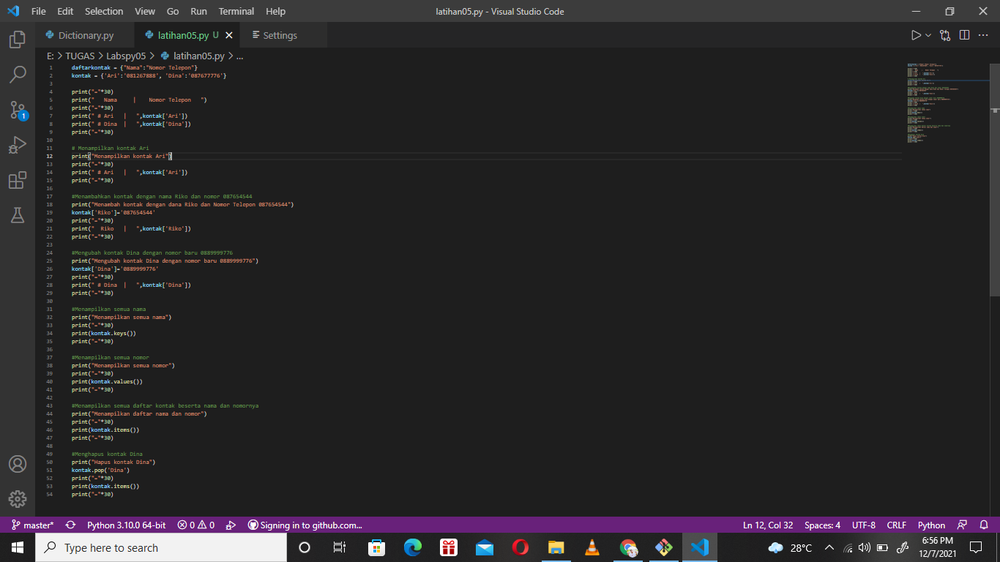
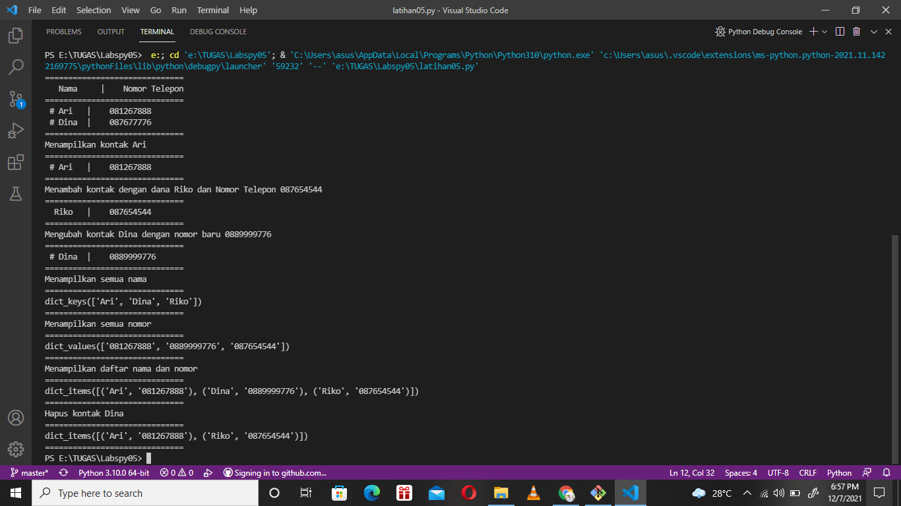
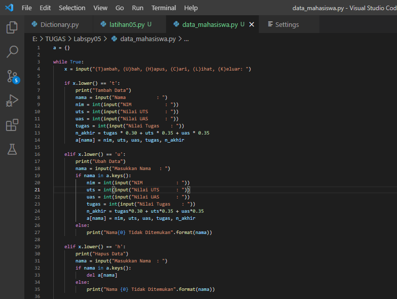
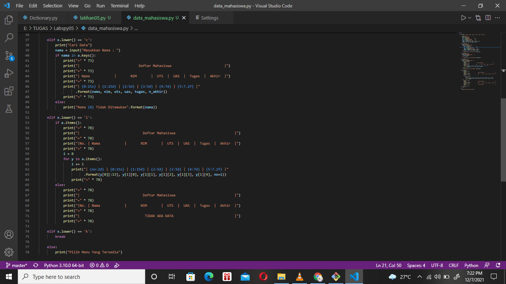
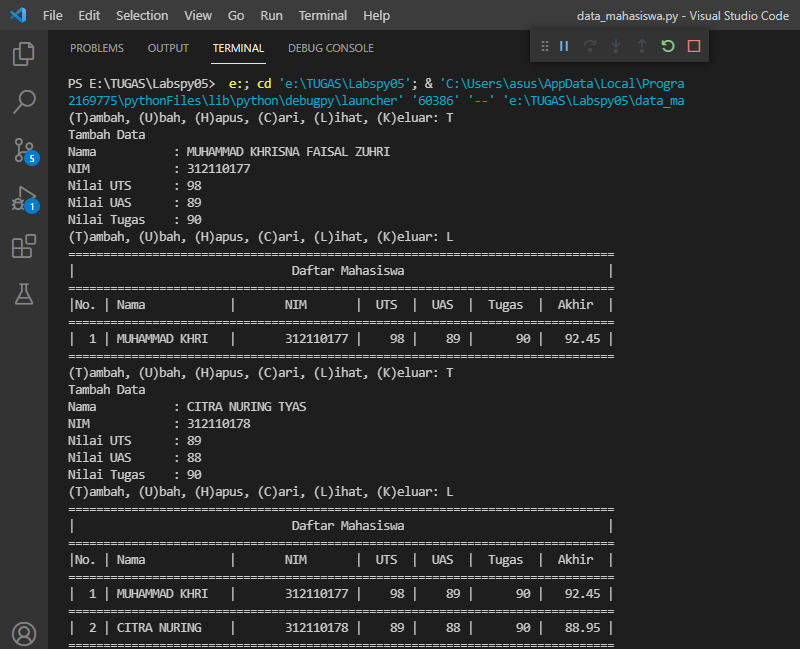
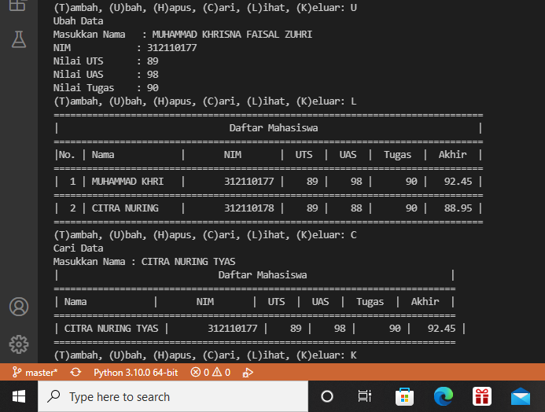

# Labspy05
Berisi latihan dictionary pada python dan praktikum membuat Program Daftar Nilai Mahasiswa menggunakan dictionary dan juga menampilkan pilihan menu .
## Latihan yang pertama adalah membuat daftar kontak dengan menggunakan dictionary pada python
>>> berikut ini adalah gambar programnya

### Berikut ini adalah penjelasan programnya
>>> mengakses atau menampilkan kontak yang telah ditampung dalam data dictionary
>>> menampilkan daftar kontak ari,riko,dina
>>> mengubah kontak dina
>>> menampilkan semua nama kontak
>>> menampilkan semua nomor kontak 
>>> menampilkan semua daftar kontak dengan nama dan nomor telepon
>>> menghapus kontak dina
### Berikut ini adalah hasil programnya

# Praktikum
## Dibawah ini adalah program untuk membuat daftar nilai mahasiswa dengan menggunakan dictionary, dan menampilkan pilihan menu 
### Berikut ini adalah gambar programnya :

### Berikut ini adalah flowchartnya :

>>> dan berikut ini adalah hasil dari programnya, dan untuk menampilkan programnya yaitu ketik : (T) untuk Tambah data , (U) untuk Ubah , (H) untuk Hapus , (C) untuk Cari , (L) untuk Lihat , (K) untuk Keluar

>>>> SEKIAN TERIMA KASIH

